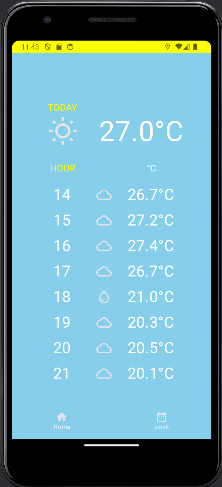
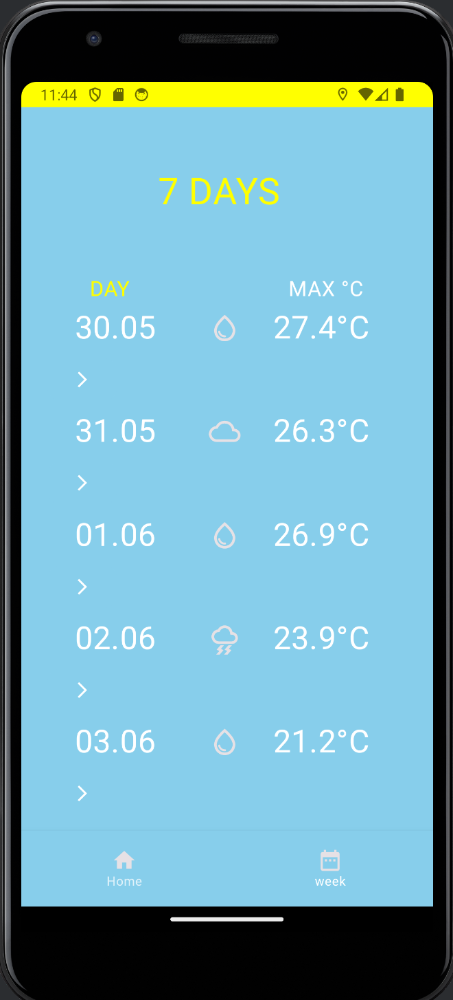
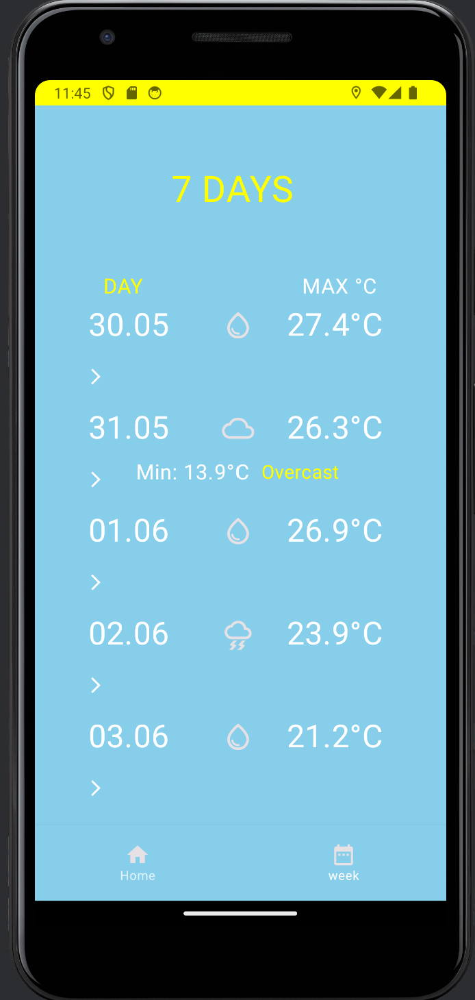

# Weather-app
An application that can be used to check current weather, next 24h and 7 day forecast in users location. The app uses users location and open-meteo API.

# Motivation
A part of mobiledevelopment course.

# Screencast
https://www.youtube.com/watch?v=VJQuvy3J-XA

# Screenshots

# Tech/framework used
Kotlin, Jetpack Compose

# Installation

# Author
Anna Kulovuori (https://github.com/annakulovuori)
